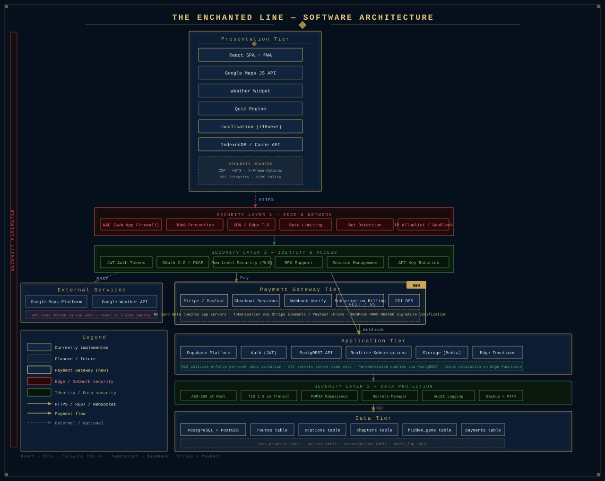

# Interactive Train Journey Map

An art-deco interactive single-page app that simulates a heritage train journey from **Pretoria to Cape Town** across 9 stations. Built with React, Vite, and Tailwind CSS v4.

---

## Features

- Animated SVG locomotive that travels along a stylised map of South Africa
- Per-station heritage stories and hidden gems revealed as the train arrives
- Multi-language UI: English, isiZulu, Afrikaans, Sesotho
- Wax-seal passport stamps collected at each departed station
- Art-deco visual theme throughout

---

## Tech Stack

| Tool | Version |
|---|---|
| Node.js | 22 |
| pnpm | 10.34.3 |
| React | 19 |
| Vite | 8 |
| Tailwind CSS | 4 |
| TypeScript | 5.7 |

---

## Local Development

### Prerequisites

- [Node.js 22+](https://nodejs.org/)
- [pnpm 10+](https://pnpm.io/installation)

```bash
# Install pnpm if you don't have it
npm install -g pnpm@10.34.3
```

### Install and run

```bash
# 1. Install dependencies
pnpm install

# 2. Start the dev server
pnpm dev
```

The app will be available at **http://localhost:8443** (or the next free port).  
Changes to source files are reflected immediately via Vite's hot module replacement.

---

## Building for Production

```bash
pnpm build
```

The output is written to the `dist/` folder — a fully static bundle of HTML, CSS, and JS. No server is required to serve it.

To preview the production build locally before deploying:

```bash
pnpm preview
```

---

## Deployment

### Option 1 — Vercel (recommended)

1. Push the project to a GitHub, GitLab, or Bitbucket repository.
2. Go to [vercel.com](https://vercel.com) and click **Add New Project**.
3. Import your repository.
4. Vercel will auto-detect Vite. Confirm these settings if prompted:
   - **Framework preset:** Vite
   - **Build command:** `pnpm build`
   - **Output directory:** `dist`
5. Click **Deploy**.

Every push to `main` triggers an automatic redeploy.

---

### Option 2 — Netlify

1. Push the project to a Git repository.
2. Go to [netlify.com](https://netlify.com) → **Add new site** → **Import an existing project**.
3. Connect your repository and set:
   - **Build command:** `pnpm build`
   - **Publish directory:** `dist`
4. Click **Deploy site**.

Alternatively, deploy directly from the CLI:

```bash
# Install the Netlify CLI
npm install -g netlify-cli

# Build, then deploy
pnpm build
netlify deploy --prod --dir=dist
```

---

### Option 3 — GitHub Pages

1. Install the `gh-pages` helper:

```bash
pnpm add -D gh-pages
```

2. Add a `deploy` script to `package.json`:

```json
"scripts": {
  "deploy": "pnpm build && gh-pages -d dist"
}
```

3. If the app is served from a sub-path (e.g. `https://username.github.io/repo-name/`), set the base in `vite.config.ts`:

```ts
export default defineConfig({
  base: '/repo-name/',
  // ...existing config
})
```

4. Deploy:

```bash
pnpm deploy
```

The site will be live at `https://<username>.github.io/<repo-name>/`.

---

### Option 4 — Any Static Host (Nginx, Apache, S3, etc.)

Run `pnpm build`, then upload the contents of the `dist/` folder to your host's web root.

For hosts that handle client-side routing, configure them to serve `index.html` for all routes. For this app (single route, no React Router), no special configuration is needed.

**Nginx example:**

```nginx
server {
  listen 80;
  root /var/www/train-journey/dist;
  index index.html;

  location / {
    try_files $uri $uri/ /index.html;
  }
}
```

---

## Architecture

The application is structured as a four-tier architecture. The Presentation Tier is fully implemented today; the remaining tiers outline the planned full-stack evolution.



```
┌─────────────────────────────┐
│      Presentation Tier      │  ← Fully implemented (React SPA)
└──────────────┬──────────────┘
               │ REST / HTTPS / WebSocket
     ┌─────────┴──────────────────────────┐
     │                                    │
┌────▼──────────┐        ┌───────────────▼──────────────┐
│ External      │        │      Application Tier         │
│ Services      │        │      (Supabase Platform)      │
└───────────────┘        └───────────────┬──────────────┘
                                         │ SQL
                         ┌───────────────▼──────────────┐
                         │         Data Tier             │
                         │  (PostgreSQL + PostGIS)       │
                         └──────────────────────────────┘
```

| Tier | Technology | Status |
|---|---|---|
| Presentation | React 19, Vite 8, Tailwind CSS v4, TypeScript | ✅ Implemented |
| External Services | Google Maps Platform, Google Weather API | 🔲 Planned |
| Application | Supabase (Auth, PostgREST, Realtime, Storage, Edge Functions) | 🔲 Planned |
| Data | PostgreSQL + PostGIS (routes, stations, chapters, hidden_gems, user_progress) | 🔲 Planned |

For the full architecture breakdown including schema design, data flow, and technology decisions see [docs/ARCHITECTURE.md](./docs/ARCHITECTURE.md).

---

## Project Structure

```
src/
├── App.tsx          # All components, data, and application logic
├── index.css        # Global styles, Tailwind import, and CSS keyframe animations
├── main.tsx         # React entry point
└── vite-env.d.ts    # Vite type declarations

index.html           # HTML shell
vite.config.ts       # Vite + Tailwind plugin config
tsconfig.json        # TypeScript config
package.json         # Dependencies and scripts
```

---

## Available Scripts

| Command | Description |
|---|---|
| `pnpm dev` | Start the development server with hot reload |
| `pnpm build` | Build for production into `dist/` |
| `pnpm preview` | Serve the production build locally |
| `pnpm format` | Format source files with oxfmt |
